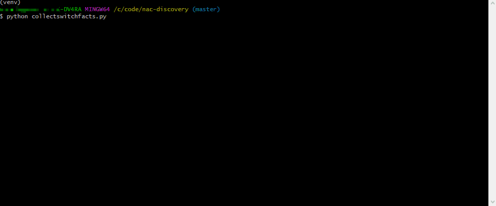

# collectswitchfacts_hybrid.py
A discovery and collection tool which pulls information from an inventory of switches and provides useful data points and recommendations on which ports to apply or exclude 802.1x NAC configurations. Information is exported to an Excel workbook so that any team can work with the data to then build appropriate configs. Today this information gathering and port recommendation relies on LLDP, Mac Tables, Port Descriptions and MAC Vendor OUI lookup. 

Ideally inventory files should be built dynamically using input from external sources and network tools like NETMRI, DNA Center, SolarWinds etc.

Built using the opensource Nornir and Napalm Python libraries. Nornir inventory files not included in repo, please consult https://nornir.readthedocs.io/en/latest/tutorials/intro/inventory.html

  TODO:
  - Add function to create dynamic Nornir inventory .yaml files based on external source using installed location etc as input 
  - Add logging function and output to execution logfile
  - Add passkey() or similar functionality for handling login credentials in production environments
  - improve interface normalization and move to function to handle discrepancies between napalm getters and interface names.
  - move description keywords to variable at top and/or provide --flag for input at CLI
  - Add exclusion based on Switchport mode vs Routed mode
  - Refactor and explore streamlining all napalm getters into a single task.

# iosnacconfparser.py
A Separate project which uses a switch configuration file parser and the python library ciscoconfparse for identifying where to apply appropriate NAC configs and then generates those configs for deployment. 

iosparser.py """ Iterates Cisco IOS configuration files in a directory to return a list of interfaces that contain relevant children statements. From this list generate configuration files that include NAC changes. One file for complete configuration and one file for new changes only. Today the script considers the following: Switchport mode access, shutdown status and description keywords as whether to apply NAC commands."""

Both scripts were tested with Catalyst 3850/9300/9500 switches running XE 16.6 and 16.8, but should run on most ios versions.
